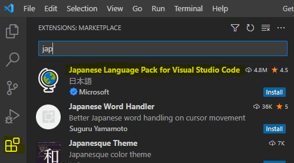
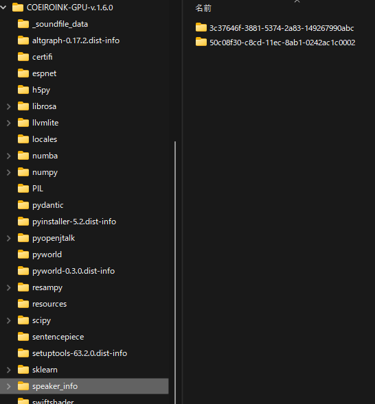

# MaiNovel - セットアップガイド

MaiNovel のセットアップ手順です。

* [Google Chrome](https://www.google.com/intl/ja_jp/chrome/) をインストールします。
* [Visual Studio Code](https://code.visualstudio.com/) をインストールします。
	* 拡張機能の [PowerShell](https://marketplace.visualstudio.com/items?itemName=ms-vscode.PowerShell) をインストールします。 
* [COEIROINK](https://coeiroink.com/) は Zip を適当なフォルダに展開します。
	* [MYCOEIROINK](https://coeiroink.com/mycoeiroink) の『[ろさちゃん](https://senolosachan.com/download-%e2%94%82-type-%cf%87/)』をインストールします。
* MaiNovel は Zip を適当なフォルダに展開します。
* [画像生成 AI](https://www.google.com/search?q=%E7%94%BB%E5%83%8F%E7%94%9F%E6%88%90+AI) を利用できるようにします（後回しにできます）。
* セットアップが終わったら、[チュートリアル](Tutorial.md) に進みます。

# Google Chrome のインストール

* [Google Chrome 公式サイト](https://www.google.com/intl/ja_jp/chrome/)で「Chrome をダウンロード」して、インストールします。
	* Chrome を Windows のデフォルトのブラウザ（*.html の既定のアプリ）に設定すると、ノベルの作成が少し楽になります。

# Visual Studio Code のインストール

* [Visual Studio Code 公式サイト](https://code.visualstudio.com/)で「Download for Windows Stable Build」して、インストールします。

Visual Studio Codeをインストールしたら起動して、拡張機能をインストールします。

* ウィンドウ左の縦に並ぶアイコンの「拡張機能 (Ctrl + Shit + X)」を開きます。
* 上部の「Marketplace で拡張機能を検索する」に「jap」と入力して、「[Japanese Language Pack for Visual Studio Code](https://marketplace.visualstudio.com/items?itemName=MS-CEINTL.vscode-language-pack-ja)」拡張を「インストール」し、画面右下に表示される「Change Language and Restart」で再起動します。  

* 同様に拡張機能で「pow」と入力して、Microsoft の 「[PowerShell](https://marketplace.visualstudio.com/items?itemName=ms-vscode.PowerShell)」拡張を「インストール」します。  
その後に表示される「Install PowerShell 7」をインストールする必要はありません。

拡張機能のインストールを終えたら、Visual Studio Codeの設定をします。
設定画面はメニューの「ファイル > ユーザー設定 > 設定 (Ctrl + ,)」で開きます。

* 「よく使用するもの」にある「Editor: Render Whitespace」を「boundary」に設定します。
* 「よく使用するもの」にある「Editor: Word Wrap」を「on」に設定します。
* 「テキスト エディター > 書式設定」にある「Format On Save」を有効にします。

設定が終了したら、Visual Studio Code を閉じます。

## 他の役立ちそうな Visual Studio Code 拡張機能（オプション）

* ノベルファイルは階層が深くなりがちなので、「[indent-rainbow](https://marketplace.visualstudio.com/items?itemName=oderwat.indent-rainbow)」による階層の色分けが役立ちます。
* アイコンを変えると華やかになります。
	* 「[vscode-icons](https://marketplace.visualstudio.com/items?itemName=vscode-icons-team.vscode-icons)」か「[Material Icon Theme](https://marketplace.visualstudio.com/items?itemName=PKief.material-icon-theme)」をお好みで。

Visual Studio Code の拡張機能は、ダウンロード数が100万(1M)を超えるような、人気のあるものを利用するのがおすすめです。

# COEIROINK のインストール

* [COEIROINK 公式サイト](https://coeiroink.com/) の「[DOWNLOAD PAGE](https://coeiroink.com/download)」の指示に沿って最新の COEIROINK GPU(Windows) 版をインストールします。
* インストール先にある「COEIROINKonVOICEVOX.exe」を実行すると、COEIROINK が立ち上がります。
* 起動シーケンスを終えたら、適当な文章を入力して音声の再生ができることを確認します。
	* COEIROINK の音声の再生で問題が発生するようでしたら、公式の「[Q & A](https://coeiroink.com/q_and_a)」を確認してください。
	* COEIROINK の GPU 版が利用できないようでしたら、CPU 版を利用します。
* 音声の再生を確認できたら COEIROINK を閉じて、「COEIROINKonVOICEVOX.exe」のショートカットを適当な場所に作成します。

## COEIROINK に MYCOEIROINK を追加

MaiNovel のサンプルで使用している [MYCOEIROINK](https://coeiroink.com/mycoeiroink) の『[ろさちゃん](https://senolosachan.com/download-%e2%94%82-type-%cf%87/)』をインストールします。

「ろさちゃん」は以前に確認した範囲では品質が高く、商用利用やゾーニングが必要なコンテンツでの利用が可能な MYCOEIROINK です。
ただし、 [日々新しい MYCOEIROINK が登録](https://coeiroink.com/mycoeiroink#app)されていますので、同様の手順でお好みの音声合成を追加してご利用ください。

* [ろさちゃん配布ページ](https://senolosachan.com/download-%e2%94%82-type-%cf%87/) の下部にある「MYCOEIROINK」から「ロサちゃん音源（統合版）」をダウンロードします。
* Zip の展開先にある「50c08f30-c8cd-11ec-8ab1-0242ac1c0002」といったハッシュ値フォルダを、COEIROINKの展開先にある「speaker_info」フォルダに移動します。 
デフォルトでインストールされている「つくよみちゃん」の「3c37646f-3881-5374-2a83-149267990abc」といったハッシュ値フォルダに並べるようにします。 

* 「COEIROINKonVOICEVOX.exe」を起動しなおすと、「ろさちゃん」が利用できるようになります。

# MaiNovel のインストール

* [MaiNovel の Release ページ](https://github.com/Zuntan03/MaiNovel/releases) から最新の「MaiNovel-v*.zip」をダウンロードして、適当なフォルダに展開します。
	* 浅めのフォルダ階層で、スペースを含まない、英数字のみのパスだと安心です。

# 画像生成 AI の用意

画像生成 AI を、今セットアップする必要はありません。
画像生成 AI は進歩がとても激しいため、自身の希望と状況にあった[画像生成 AI](https://www.google.com/search?q=%E7%94%BB%E5%83%8F%E7%94%9F%E6%88%90+AI)をご利用ください。

# セットアップが完了したら

[チュートリアル](Tutorial.md) に進みます。
