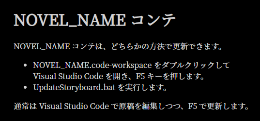
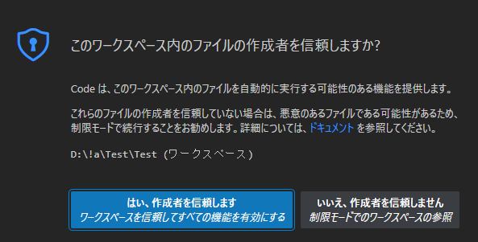
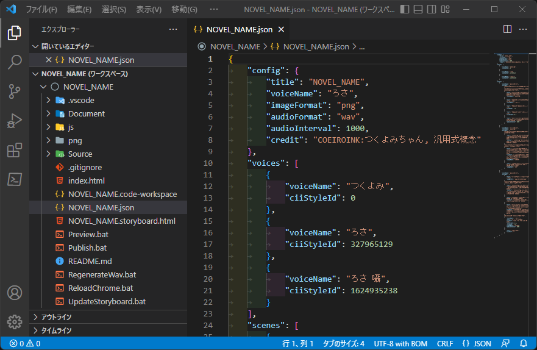

# MaiNovel - チュートリアル

MaiNovel のチュートリアルでは、コンテで音声を生成し、ノベルを動かすところまでを説明します。

ファイル名などのパスを記載する際に /NOVEL_NAME.json といった表記を使用します。 
/（スラッシュ）で開始するパスは主にノベル作成環境内の相対パスで、NOVEL_NAME はノベル作成時に指定した名前です。

# ノベル作成環境の用意

1. MaiNovel の展開先にある CreateNovel.bat をダブルクリックで実行します。
1. 画面の案内に沿って、英数字でノベルの名前を入力します。
	* ファイルやフォルダの名前に利用できる記号も使用できます。
	* 以降の説明ではここで入力したノベルの名前を NOVEL_NAME と表記します。
1. MaiNovel の展開先に、ノベル作成環境である NOVEL_NAME フォルダが生成されます。
	* この NOVEL_NAME フォルダは好きな場所に移動できます。

# コンテでの音声の生成

1. COEIROINK のインストール時に作成したショートカットか、COEIROINK 展開先の COEIROINKonVOICEVOX.exe を実行して、COEIROINK を立ち上げておきます。
1. /NOVEL_NAME/NOVEL_NAME.html を Chrome で開くと、以下のような表示がされます。 

1. /NOVEL_NAME/NOVEL_NAME.code-workspace で Visual Studio Code を立ち上げると、以下のダイアログが表示されますので、信頼します。 

1. Visual Studio Code のエクスプローラーで NOVEL_NAME.json を開くと、以下の画面になります。 
 
README.md を右クリックし、「プレビューを開く」でドキュメントを確認できます。
1. Visual Studio Code でキーボードの「F5」を押すと、COEIROINK での音声の生成が開始されます。 
しばらくしてすべての音声の生成が終わると、Chrome の表示が更新されます。
1. Chrome のコンテで音声の再生ボタンを押すと、生成された音声を確認できます。
1. NOVEL_NAME.json の内容を書き換えてから再度「F5」を押すと、書き換えた部分のみ音声が再生成された後に、Chrome の表示が更新されます。
	* NOVEL_NAME.json はサンプルを兼ねています。 
	最初は先頭にある「実験用のシーン」を書き換えて、色々試してみてください。

# ノベルを動かす

1. 文章と音声が一段落したら、COEIROINK を立ち上げた状態で /RegenerateWav.bat を実行して、ノベル用の音声をすべて再生成します。
1. 音声の生成が終わったら /Preview.bat を実行し、「 http://127.0.0.1/Temporary_Listen_Addresses/ 」と書かれている部分を Ctrl + 左クリックすると、Web ブラウザでノベルを確認できます。
1. /png/s[シーン番号]/s[シーン番号]m[メッセージ番号].png といった画像を用意し、ブラウザをリロードすると、指定したシーンのメッセージで画像が表示されます。 
例：/png/s01/s01m02.png は、ふたつめのシーンのみっつめのメッセージで表示されます。
