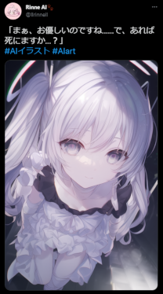
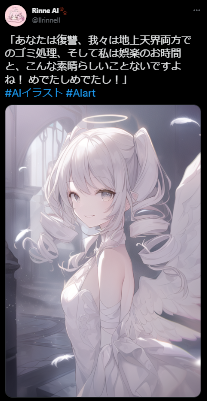
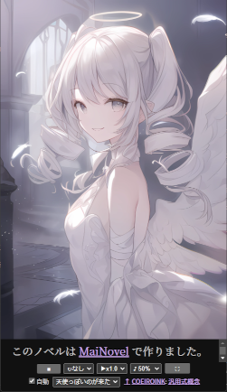

# MaiNovel - README

MaiNovel は AI 技術を使って手軽にビジュアルノベルを作るコンパクトなツールです。

AI 技術の発展で、誰でも手軽に内心を自由に表現できる未来が近づいています。<br>
そんな中で、まずはビジュアルノベルの作成がどれだけ手軽になるのかを、コンパクトに試してみました。

仕事などで自由時間が少なくても、絵や声優のスキルが無くても、ビジュアルノベルでの表現ができます。

# どんなもの？

## ステップ1: AI 画像生成などで、絵を用意します。

今回は [Rinne さん](https://twitter.com/llrinnell) から許諾を得て、ツイートの画像でノベルを作ります。

[](https://twitter.com/llrinnell/status/1605373421491101696)
[](https://twitter.com/llrinnell/status/1605397648424374272)
[](https://twitter.com/llrinnell/status/1605427846838632449)
[](https://twitter.com/llrinnell/status/1605458048318730240)
[](https://twitter.com/llrinnell/status/1605488249492733952)

## ステップ2: ノベルを書きます。

プレフィックスの cii は CoeIroInk の略です。

```json
{
	"config": {
		"title": "天使っぽいのが来た",
		"voiceName": "素",
		"imageFormat": "webp",
		"audioFormat": "aac",
		"credit": "COEIROINK: 汎用式概念"
	},
	"voices": [
		{ "voiceName": "素", "ciiStyleId": 327965129 },
		{ "voiceName": "囁", "ciiStyleId": 1624935238 }
	],
	"scenes": [
		{
			"sceneName": "来訪",
			"messages": [
				{
					"text": "こんにちはー、天国の方から来ました。いますよねー？",
					"ciiVolume": 0.5
				},
				"…",
				{
					"text": "†エンジェリックマスターキー†",
					"voiceName": "囁",
					"ciiSpeed": 0.7,
					"ciiVolume": 0.5
				},
				{
					"text": "あらあら、空いてますねー",
					"ciiVolume": 0.75
				},
				"こんにちは！あなたを救いにきました！",
				"…",
				"なるほど、さぞおつらかったでしょう…",
				"では、殺しますか？",
				"…",
				"まぁ、お優しいのですね…",
				"で、あれば死にますか…？",
				"…",
				"ですよね！ ",
				"私共としてもそちらのコースがおすすめなので、今ならなんと天使の羽毛布団つきっ！",
				"あなたは復讐、我々は地上天界両方でのゴミ処理、そして私は娯楽のお時間と、こんな素晴らしいことないですよね！",
				"…",
				"はいっ、おしまいっ。"
			]
		}
	]
}
```

## ステップ3: [できあがり（リンク先でノベルを確認できます）。](https://yyy.wpx.jp/m/av)

[](https://yyy.wpx.jp/m/av/)

## [**より長いノベルの例はこちら**](https://yyy.wpx.jp/m/)

# はじめに

MaiNovel でノベルを作成するには、まず [セットアップガイド](Document/SetupGuide.md) と [チュートリアル](Document/Tutorial.md) でノベルを動かしてみてください。<br>
ノベルを動かしてみて、ノベルの作成に興味を持てそうでしたら [ノベル作成ガイド](Document/NovelCreationGuide.md) もどうぞ。

[ノベルファイルフォーマット](Document/NovelFileFormat.md) は、最初は見なくても問題ありません。

* [セットアップガイド](Document/SetupGuide.md)
* [チュートリアル](Document/Tutorial.md)
* [ノベル作成ガイド](Document/NovelCreationGuide.md)
* [ノベルファイルフォーマット](Document/NovelFileFormat.md)

# 動作環境

* Windows 10 以降の Windows PC
	* 動作確認では Windows 11 を使用しています。
	* ノベルの再生は Android 版の Chrome でも動作確認しています。
* [COEIROINK](https://coeiroink.com/)
	* ライセンスが使いやすく、自作の音声合成を利用できる無料の音声合成ソフトです。
		* 商用やゾーニングの必要なコンテンツでも無料で使える[利用規約](https://coeiroink.com/terms)です。 
		* [MYCOEIROINK](https://coeiroink.com/mycoeiroink) で音声合成を自作できます。
		* [他作の MYCOEIROINK](https://coeiroink.com/mycoeiroink#app) も利用できます。<br>ただし、利用規約がそれぞれ異なりますので、ご注意ください。
	* 動作確認では COEIROINK-GPU-v.1.6.0(Windows) 版を使用しています。
* [Visual Studio Code](https://code.visualstudio.com/)
	* ノベルの執筆に利用します。
* [Google Chrome](https://www.google.com/intl/ja_jp/chrome/)
	* ノベルの再生に利用します。
* [お好みの画像生成 AI](https://www.google.com/search?q=AI%E7%94%BB%E5%83%8F%E7%94%9F%E6%88%90)
	* 画像生成 AI は進歩がとても激しいため、自身の希望と状況にあった画像生成 AI をご利用ください。

# ライセンス

MaiNovel は [MIT License](LICENSE.txt) です。

This software is released under the MIT License, see [LICENSE.txt](LICENSE.txt).
